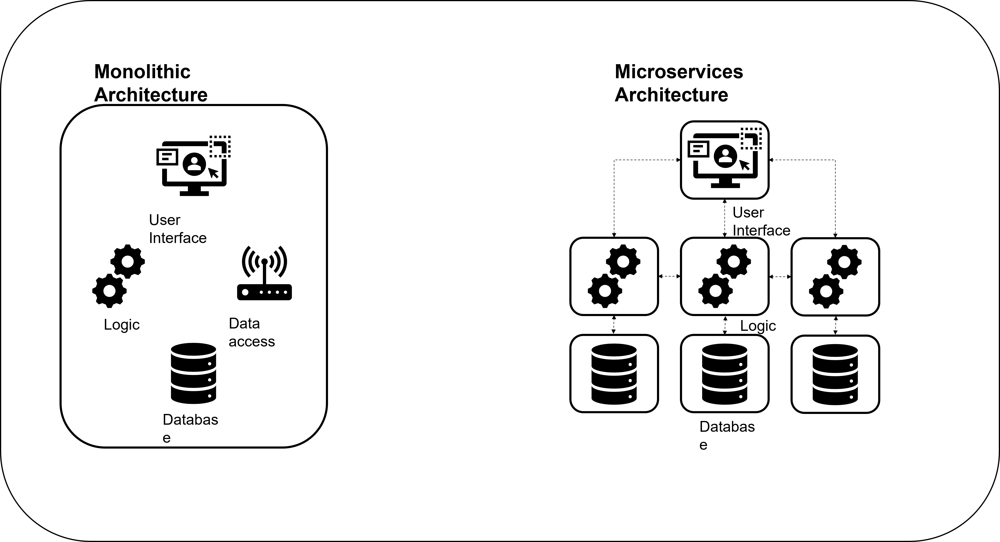

# An introduction into Microservices

Microservices architecture is an approach to building software applications by breaking them down into small, independent services that work together. Each service focuses on a specific task and communicates with other services through APIs.

Use cases for microservices architecture include:

1. Scalable web applications that handle high traffic loads.
2. Complex systems with multiple functionalities, such as e-commerce platforms or content management systems.
3. Mobile applications that require backend services for user management, data synchronization, and third-party integrations.
4. Internet of Things (IoT) applications that connect and manage devices, collect and process data, and integrate with other IoT ecosystems.
5. Modernizing and modularizing monolithic enterprise systems to improve scalability, maintainability, and integration capabilities.

Microservices offer benefits like scalability, flexibility, fault isolation, and easier integration. However, implementing microservices requires careful planning and management due to the added complexity compared to traditional architectures.

### **Comparing a monolith, multi-tier and microservices architecture**

A monolithic architecture is a single, tightly-coupled application, while multi-tier architecture divides the application into logical layers. Microservices architecture, on the other hand, focuses on building independent services that communicate with each other, allowing for flexibility, scalability, and easier integration.

### **Three case studies of organisations using Microservices**

Netflix: Netflix is a popular streaming platform that utilizes microservices architecture to provide seamless streaming experiences to millions of users worldwide. By breaking down their application into numerous microservices, such as user authentication, recommendation engine, content delivery, and billing, Netflix can independently scale and update each service based on demand. This allows them to handle high traffic loads and deliver personalized content to users efficiently.

Uber: Uber, the ride-hailing service, relies on microservices architecture to power its platform. Uber's microservices handle various functions, including real-time GPS tracking, trip management, payment processing, and driver dispatching. This modular approach enables Uber to rapidly develop and deploy new features, respond to user requests in real-time, and scale their services to accommodate millions of users worldwide.

Spotify: Spotify, the music streaming platform, has embraced microservices architecture to support its vast catalog of songs and deliver a seamless music streaming experience. Spotify's microservices handle tasks like music recommendation, user playlists, social features, and payment processing. This architecture allows Spotify to continuously innovate and release new features while maintaining a high level of scalability, reliability, and personalized music recommendations for their users.

### **Why microservices may not be suitable**

The decision to use microservices should consider the specific requirements, constraints, and resources available for your application.

The following are examples that may be unsuitable for microservices:

1. Small or Simple Applications: If your application is small in scale or has limited functionality, the added complexity of microservices may outweigh the benefits.

2. Tight Interdependencies: If the services in your application have strong dependencies and tightly coupled interactions, it may be more challenging to split them into independent microservices.

3. Performance Constraints: Microservices introduce network communication overhead, which can impact performance, especially in latency-sensitive applications.

4. Limited Resources: Building and managing microservices require additional resources, including expertise, infrastructure, and monitoring capabilities. If you have limited resources, it may be more practical to use a simpler architecture.

5. Legacy Systems: If you have a legacy system that is difficult to refactor or integrate with microservices, it may be more practical to continue with the existing architecture rather than undertaking a complex migration.

### **An introduction to Docker**

Docker is a tool that simplifies the packaging and execution of applications within isolated environments known as containers. It offers a consistent and portable solution for deploying applications across various systems.

The use cases for Docker are as follows:

1. Streamlined Application Deployment: Docker streamlines the deployment process by bundling applications and their dependencies into containers. This ensures consistent execution across different environments.

2. Microservices Architecture: Docker is well-suited for building and deploying applications using a microservices approach. It enables individual microservices to be encapsulated within separate containers, allowing for scalability and independent development.

3. Continuous Integration and Continuous Deployment (CI/CD): Docker plays a crucial role in CI/CD pipelines by providing a reliable and reproducible environment for building, testing, and deploying applications. Containers offer consistency in development and testing environments.

4. Scalability and Load Balancing: Docker simplifies the scaling of applications by running multiple containers. Load balancers can distribute traffic among these containers, optimizing resource utilization and improving overall application performance.

5. Development and Testing Environments: Docker provides developers and testers with consistent and isolated environments. Containers can be used to replicate the production environment, facilitating seamless development and testing of applications.

6. Hybrid and Multi-Cloud Deployments: Docker enables applications to be deployed across different cloud platforms or on-premises infrastructure. Containers ensure portability, allowing for easy migration and deployment flexibility.

In summary, Docker streamlines application deployment, supports microservices architecture, enhances CI/CD processes, enables scalability and load balancing, provides consistent development and testing environments, and facilitates hybrid and multi-cloud deployments.