# Microservices using Docker and Kubernetes (K8) <!-- omit in toc -->

## Contents <!-- omit in toc -->

- [An introduction into Microservices](#an-introduction-into-microservices)
  - [Comparing a monolith, multi-tier and microservices architecture](#comparing-a-monolith-multi-tier-and-microservices-architecture)
  - [Three case studies of organisations using Microservices](#three-case-studies-of-organisations-using-microservices)
  - [Why microservices may not be suitable](#why-microservices-may-not-be-suitable)
- [An introduction to Docker](#an-introduction-to-docker)
  - [Security for Docker](#security-for-docker)
  - [Section 1: Creating a Docker container to host a profile and application](#section-1-creating-a-docker-container-to-host-a-profile-and-application)
    - [Dockerfile for a profile running nginx](#dockerfile-for-a-profile-running-nginx)
    - [Dockerfile for an application running nodejs](#dockerfile-for-an-application-running-nodejs)
  - [Section 2: Configuring a database image](#section-2-configuring-a-database-image)
  - [Section 3: Creating a Microservices Architecture using Docker](#section-3-creating-a-microservices-architecture-using-docker)
- [Introduction to Kubernetes](#introduction-to-kubernetes)
  - [Section 4: Creating a Microservices Architecture using K8](#section-4-creating-a-microservices-architecture-using-k8)


## An introduction into Microservices

Microservices architecture is an approach to building software applications by breaking them down into small, independent services that work together. Each service focuses on a specific task and communicates with other services through APIs.

Use cases for microservices architecture include:

1. Scalable web applications that handle high traffic loads.
2. Complex systems with multiple functionalities, such as e-commerce platforms or content management systems.
3. Mobile applications that require backend services for user management, data synchronization, and third-party integrations.
4. Internet of Things (IoT) applications that connect and manage devices, collect and process data, and integrate with other IoT ecosystems.
5. Modernizing and modularizing monolithic enterprise systems to improve scalability, maintainability, and integration capabilities.

Microservices offer benefits like scalability, flexibility, fault isolation, and easier integration. However, implementing microservices requires careful planning and management due to the added complexity compared to traditional architectures.

### Comparing a monolith, multi-tier and microservices architecture

A monolithic architecture is a single, tightly-coupled application, while multi-tier architecture divides the application into logical layers. Microservices architecture, on the other hand, focuses on building independent services that communicate with each other, allowing for flexibility, scalability, and easier integration.


### Three case studies of organisations using Microservices

Netflix: Netflix is a popular streaming platform that utilizes microservices architecture to provide seamless streaming experiences to millions of users worldwide. By breaking down their application into numerous microservices, such as user authentication, recommendation engine, content delivery, and billing, Netflix can independently scale and update each service based on demand. This allows them to handle high traffic loads and deliver personalized content to users efficiently.

Uber: Uber, the ride-hailing service, relies on microservices architecture to power its platform. Uber's microservices handle various functions, including real-time GPS tracking, trip management, payment processing, and driver dispatching. This modular approach enables Uber to rapidly develop and deploy new features, respond to user requests in real-time, and scale their services to accommodate millions of users worldwide.

Spotify: Spotify, the music streaming platform, has embraced microservices architecture to support its vast catalog of songs and deliver a seamless music streaming experience. Spotify's microservices handle tasks like music recommendation, user playlists, social features, and payment processing. This architecture allows Spotify to continuously innovate and release new features while maintaining a high level of scalability, reliability, and personalized music recommendations for their users.

### Why microservices may not be suitable

The decision to use microservices should consider the specific requirements, constraints, and resources available for your application.

The following are examples that may be unsuitable for microservices:

1. Small or Simple Applications: If your application is small in scale or has limited functionality, the added complexity of microservices may outweigh the benefits.

2. Tight Interdependencies: If the services in your application have strong dependencies and tightly coupled interactions, it may be more challenging to split them into independent microservices.

3. Performance Constraints: Microservices introduce network communication overhead, which can impact performance, especially in latency-sensitive applications.

4. Limited Resources: Building and managing microservices require additional resources, including expertise, infrastructure, and monitoring capabilities. If you have limited resources, it may be more practical to use a simpler architecture.

5. Legacy Systems: If you have a legacy system that is difficult to refactor or integrate with microservices, it may be more practical to continue with the existing architecture rather than undertaking a complex migration.

## An introduction to Docker

Docker is a tool that simplifies the packaging and execution of applications within isolated environments known as containers. It offers a consistent and portable solution for deploying applications across various systems.

The use cases for Docker are as follows:

1. Streamlined Application Deployment: Docker streamlines the deployment process by bundling applications and their dependencies into containers. This ensures consistent execution across different environments.

2. Microservices Architecture: Docker is well-suited for building and deploying applications using a microservices approach. It enables individual microservices to be encapsulated within separate containers, allowing for scalability and independent development.

3. Continuous Integration and Continuous Deployment (CI/CD): Docker plays a crucial role in CI/CD pipelines by providing a reliable and reproducible environment for building, testing, and deploying applications. Containers offer consistency in development and testing environments.

4. Scalability and Load Balancing: Docker simplifies the scaling of applications by running multiple containers. Load balancers can distribute traffic among these containers, optimizing resource utilization and improving overall application performance.

5. Development and Testing Environments: Docker provides developers and testers with consistent and isolated environments. Containers can be used to replicate the production environment, facilitating seamless development and testing of applications.

6. Hybrid and Multi-Cloud Deployments: Docker enables applications to be deployed across different cloud platforms or on-premises infrastructure. Containers ensure portability, allowing for easy migration and deployment flexibility.

In summary, Docker streamlines application deployment, supports microservices architecture, enhances CI/CD processes, enables scalability and load balancing, provides consistent development and testing environments, and facilitates hybrid and multi-cloud deployments.

### Security for Docker

How to maintain security within Docker:

- Use trusted and official Docker images from reputable sources.
- Keep Docker updated to the latest version for security patches.
- Minimize installed packages in containers and avoid running as root.
- Enable Docker's Content Trust feature to ensure image integrity.
- Set resource limits to prevent excessive resource usage.
- Use container orchestration tools to isolate and restrict communication.
- Secure the host system with updates, access controls, and strong configurations.
- Configure network settings properly and use firewalls for control.
- Implement centralized logging and monitoring for timely detection.
- Regularly scan Docker images and containers for vulnerabilities.
- Manage user access to Docker resources with the principle of least privilege.
- Secure private Docker image registries with access controls and authentication.

### Section 1: Creating a Docker container to host a profile and application

A prerequisite to this guide is create a new repository containing a html file describing a personal profile.

**Step 1**: Create a file named `Dockerfile` within the same repository as the .file to be copied onto the docker container.

#### Dockerfile for a profile running nginx

```docker
# pull the latest version of nginx
FROM nginx:latest

# copy the local html file to the docker container
COPY index.html /usr/share/nginx/html

# ensure to allow access through default http
EXPOSE 80
```

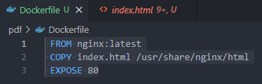

#### Dockerfile for an application running nodejs

```docker
# pull the latest version of nodejs
FROM node

# add a label maintainer
LABEL MAINTAINER=james

# navigate to the correct working directory
WORKDIR /usr/src/app

# copy the local app folder to the docker container
COPY app /usr/src/app

# expose the port to access the application
EXPOSE 3000

# run nodejs
CMD ["node", "app.js"]
```

**Step 2**: Open a Git Bash terminal and build the image; check that the image has been created.

```bash
docker build -t <new_image_name> .

docker images
```

**Step 3**: Create and deploy the container using the image and map the ports to access it through http; check the container is now running.

>Note: if an error is raised regarding `TTY`, run `alias docker="winpty docker"`.

```bash
docker run -d --name <name-container> -p <local-port>:<remote-port> <image_name>

docker ps

docker exec -it <container-id> sh
```

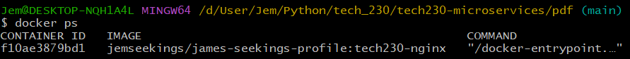

**Step 4**: Change the docker tag for the image and push the image to dockerhub. The image should now be available on dockerhub.

```bash
docker tag <image name>:<tag> <dockerhub username>/<image name>:<tag>

docker push <image name:tag>
```

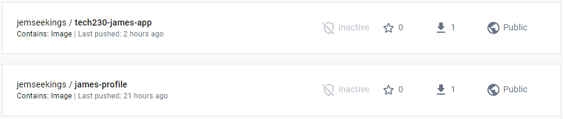

### Section 2: Configuring a database image

**Step 1**: Download and run a container of the official mongo image.

```bash
docker run -d -p 27017:27017 mongo
```

**Step 2**: Connect to the container through a shell with the container ID.

```bash
docker ps

docker exec -it <container-id> sh
```

**Step 3**: Update all the dependencies for the commands sudo and nano.

```bash
apt update -y

apt upgrade --force-y

apt install sudo -y

sudo apt install nano -y
```

**Step 4**: Amend the mongo configuration file to allow IP access from anywhere.

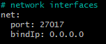

**Step 5**: Commit these changes and create a new image.

```bash
docker commit <container-id> <username>/<new-image-name>:<namespace>
```

**Step 6**: Push these changes to the dockerhub repository.

```bash
docker push <username>/<image-name>:<namespace>
```

### Section 3: Creating a Microservices Architecture using Docker

The prerequisites to this guide are to have the NodeJS application and Mongo database image locally available. For this guide, the tool `Compose` will be used to define and run multi-container docker applications. A YAML file is first created, which contains the configuration settings; this will be used to manage the whole lifecycle of the application. The two applications will be containerised and configured using the following:

- ***mongo-db***: This service contains the mongo database using the image `mongodb:3.2`. It is only accessible through port 27017, whereby the mongod.conf has already been configured to allow any IP to access it.
- ***nodejs-app***: This service contains the nodejs application using the image `tech230-james-app:latest`. It is only accessible through port 80; it is also dependent on the database and includes an environment variable to connect them.

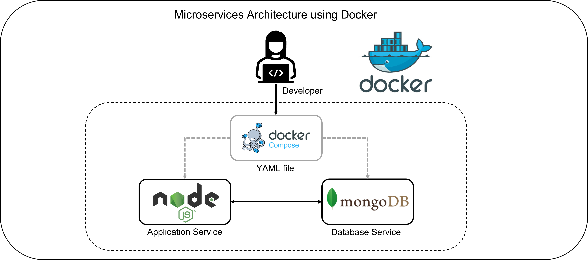

**Step 1**: Create a `docker-compose.yml` file within an appropriate repository; for example, in the application configuration repository.

**Step 2**: Within the YAML file, first include the docker compose version to be used.

```yaml
version: '3.1'
```

**Step 3**: State the configuration of the mongo database.

```yaml
services:
  mongodb:
    image: mongo:4.4
    container_name: db
    restart: always
    ports:
      - "27017:27017"
```

**Step 4**: State the configuration of the nodejs application.

>Reminder: ensure indentation is correct, where the start of the nodejs app config is in line with mongodb.

```yaml
  my-node-app:
    image: jemseekings/tech230-james-app:latest
    container_name: app
    restart: always
    depends_on:
      - mongodb
    ports:
      - "3000:3000"
    environment:
      - DB_HOST=mongodb://mongodb:27017/posts
    command: >
      sh -c "npm install && npm start"
```

**Step 5**: Run the YAML to begin building the infrastructure; once complete, this will be displayed in the docker desktop application.

>Note: To remove the infrastructure, use `docker compose rm`.

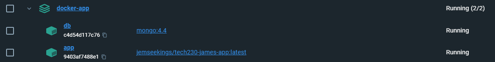

## Introduction to Kubernetes

K8s is a shorthand term for Kubernetes, an open-source platform used to manage and deploy containerized applications. It helps automate tasks to simplify the management and scaling of containerized applications, ensures high availability, provides service discovery and load balancing, promotes portability, and has a strong community and ecosystem for support and integration.

The infrastructure of K8 can be seperated into clusters, objects and services:

- A K8s cluster is a group of machines called nodes that work together under the management of Kubernetes. Nodes can be virtual or physical machines and are responsible for running containerized applications.

- K8s objects are the fundamental units used in Kubernetes to define and manage the state of applications and resources within a cluster. Examples of K8s objects include pods (which encapsulate containers), services (for networking and load balancing), deployments (for managing application versions), and more.

- K8s services enable network connectivity and load balancing within a cluster. They provide a stable endpoint for accessing a set of pods, allowing applications to communicate with each other or be exposed externally. Services abstract the underlying pod infrastructure, making it easier to connect and manage applications.

K8s deployments define the desired state of applications and handle their lifecycle management. They allow you to specify the number of replicas (pods), upgrade strategies, rollback options, and other settings. Deployments make it simple to scale, update, and roll back applications without downtime. Kubernetes is well-suited for deploying microservices-based architectures. Each microservice can be encapsulated in a container and managed as a separate pod within the Kubernetes cluster. K8s services provide networking and discovery mechanisms to connect microservices together, while deployments handle versioning, scaling, and rolling updates. This makes Kubernetes an ideal platform for deploying and managing microservices-based applications.

Kubernetes supports self-healing mechanisms to ensure the availability of applications. It constantly monitors the health of pods and containers, automatically restarting or replacing any that fail or become unresponsive. This helps maintain the desired state and reliability of applications without manual intervention. Kubernetes offers auto scaling capabilities to adjust the number of pod replicas based on resource utilization. With features like the Horizontal Pod Autoscaler (HPA), Kubernetes can automatically scale the number of replicas up or down in response to CPU, memory, or custom metrics. Auto scaling optimizes resource utilization and helps applications handle varying levels of demand.

### Section 4: Creating a Microservices Architecture using K8

This section is seperated into two sections; deployment and service. The deployment is initally to setup the pods and replicas, then the Service exposes the pods to the internet. 

**Step 1**: The first YAML file is for the Deployment, which creates and manages three replicas of Pods running the `jemseekings/tech230-james-app:latest` container image, each accessible through port 3000.

```yaml
# Specify the API version and kind of the Kubernetes resource, indicating that it is a Deployment.
apiVersion: apps/v1
kind: Deployment

# Define the metadata for the Deployment, setting the name to "app-deployment".
metadata:
  name: app-deployment

spec:

  # Insert a selector to match the labels of the Pods controlled by this Deployment.
  selector:
    matchLabels:
      app: app

  # Specify that the Deployment should maintain three replicas of the Pods.
  replicas: 3

  # Specify the Pod template for the Deployment; set the labels for the Pods to app: app.
  template:
    metadata:
      labels:
        app: app
    
    # Define a single container named "app" with the image jemseekings/tech230-james-app:latest; also expose port 3000 for the container.
    spec:
      containers:
      - name: app
        image: jemseekings/tech230-james-app:latest
        ports:
        - containerPort: 3000
```

**Step 2**: The second YAML file, for the Service named "app-svc", exposes the Pods with the label app: app as a NodePort service on port 30001, allowing access to the application running on port 3000 within the Pods.

```yaml
# Specify the API version and kind of the Kubernetes resource, indicating that it is a Service.
apiVersion: v1
kind: Service

# Define the metadata for the Service, setting the name to "app-svc" and the namespace to "default".
metadata:
  name: app-svc
  namespace: default

# Specify that the Service should listen on port 3000 and forward traffic to the Pods on port 3000; The nodePort field specifies the port on the nodes where the Service is accessible. In this case, it sets it to 30001.
spec:
  ports:
  - nodePort: 30001
    port: 3000
    targetPort: 3000
  
  # Route traffic to Pods with the label app: app.
  selector:
    app: app
  
  # Expose the service on a static port on each node in the cluster.
  type: NodePort
```

**Step 3**: Run the two files for them to be accessible on the local host on port 30001.

```bash
kubectl create -f app-deploy.yml

kubectl create -f app-service.yml
```

**Step 4**: Display the deployment and services.

```bash
kubectl get deploy
```
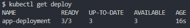
```bash
kubectl get pods
```
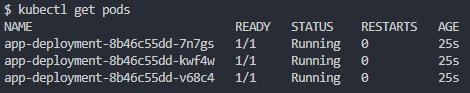
```bash
kubectl get service
```
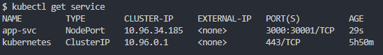

**Step 5**: To demonstrate K8s feature of high availability, first delete the pod and show list of pods to reveal an automatic deployment of another pod.

```bash
kubectl delete pod app-deployment-8b46c55dd-7n7gs

kubectl get pods
```
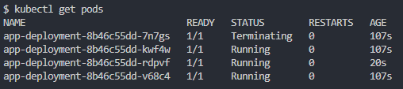

**Step 6**: K8 can also easily scale whilst in deployment; for example, changing the number of replicas to 5.

```bash
kubectl delete pod app-deployment-8b46c55dd-7n7gs
```

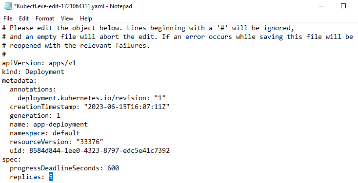

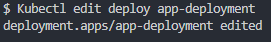

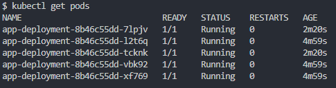